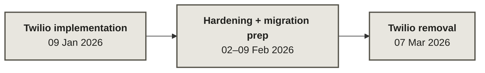

# DentSignal — historical Twilio evidence

Sanitized historical extracts showing DentSignal's earlier Twilio voice flows, callbacks, and number lifecycle work.

**An old webhook is a history lesson, not a live endpoint.**

This is a public sample from the broader private DentSignal project. The historical implementation is here for review; I can build and adapt surrounding telephony applications and provider integrations. This evidence pack does not establish today's provider or runtime.

The extracts omit credentials, clinic/customer data, environment-specific identifiers, unrelated product code, and some dependency/client wiring. They are historical slices rather than a standalone runnable application.

## Evidence map

| Artifact | What you can verify here |
|---|---|
| [`twilio_voice_flow.py`](evidence/twilio_voice_flow.py) | Earlier outbound call creation, TwiML speech gathering, lifecycle callbacks, recording callback wiring, machine detection, and call-status lookup. |
| [`twilio_number_provisioning.py`](evidence/twilio_number_provisioning.py) | Earlier number search, purchase, voice/SMS webhook configuration, webhook repair, and release helpers. |
| [`admin_number_routes.py`](evidence/admin_number_routes.py) | Historical FastAPI admin surface around number operations; surrounding auth, clinic persistence, and client injection are intentionally absent. |
| [`historical_setup_notes.md`](evidence/historical_setup_notes.md) | Setup and webhook assumptions used during that earlier provider period. |
| [`security_and_migration.md`](evidence/security_and_migration.md) | Dated hardening and migration trail, with private-history commit references. |

For the claim boundary on every published extract, use [EVIDENCE_MAP.md](EVIDENCE_MAP.md).

## Telephony timeline

Voice/callback/number work was followed by masking, logging cleanup, safer errors, and removal from active private code/docs. The [dated migration trail](evidence/security_and_migration.md) gives the provenance references; the [original historical SVG](docs/history.svg) remains available.

The public history shows an earlier Twilio implementation, later hardening/migration work, and eventual Twilio removal from the active private code/docs. It does **not** establish today's provider or runtime.

## What this proves — and what it does not

| Supported by this public pack | Not supported by this public pack |
|---|---|
| Historical provider-facing implementation shape for voice/TwiML/callback work | Current telephony provider or current production architecture |
| Historical number lifecycle and admin-route work | A standalone or end-to-end deployable application |
| A dated hardening/migration trail | Production usage, customer outcomes, reliability, or compliance guarantees |
| Sanitized provenance tied to private project history | The complete private application or every later architecture change |

## Review the boundary

- [PROVENANCE.md](PROVENANCE.md) — source period, what was preserved, what was removed, and why the extracts are non-standalone.
- [SECURITY.md](SECURITY.md) — public sanitization/security boundary.
- [docs/invariants.md](docs/invariants.md) — publication invariants.
- [docs/failure-modes.md](docs/failure-modes.md) — ways historical evidence can become misleading.

The CI **configuration** is deliberately narrow: it compiles the Python extracts, checks that the required evidence files exist, and scans code for obvious credential patterns. Those checks verify publication hygiene when they run; they do not prove end-to-end Twilio behavior, and the existence of the config alone is not a passing CI result.
