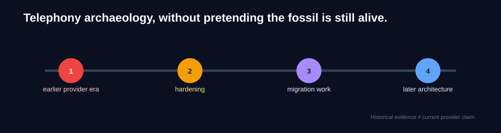

# DentSignal — Twilio Evidence

**Telephony archaeology: fewer fossils, more webhook callbacks.**

DentSignal is private. This repo is a sanitized historical evidence pack from its earlier Twilio period.

It is not a rebuilt demo, and it is not claiming Twilio is the current DentSignal runtime.

## What is here

- **`twilio_voice_flow.py`** — earlier voice-flow and callback logic;
- **`twilio_number_provisioning.py`** — earlier number-management workflow;
- **`admin_number_routes.py`** — FastAPI admin wrapper from that period;
- **`historical_setup_notes.md`** — setup assumptions from the old implementation;
- **`security_and_migration.md`** — hardening and migration context;
- **`EVIDENCE_MAP.md`** — what each artifact proves and what it does not.

## Why publish history instead of a polished fake demo?

Because the interesting part is that the work existed in the real project.

The private repository retains the original history behind these extracts. The public pack removes credentials, clinic/customer data, environment-specific identifiers, and unrelated product code.

## Timeline matters

DentSignal later moved beyond this implementation and went through additional telephony changes.

So:

**code in this repo = historical evidence**

**current architecture = a separate claim that needs separate evidence**

That distinction matters more than making the README sound impressive.

Want to verify the historical boundary? Start with the [evidence map](EVIDENCE_MAP.md), [provenance](PROVENANCE.md), [publication invariants](docs/invariants.md), and [failure modes](docs/failure-modes.md).

> Old code can be evidence without pretending to be current code.
